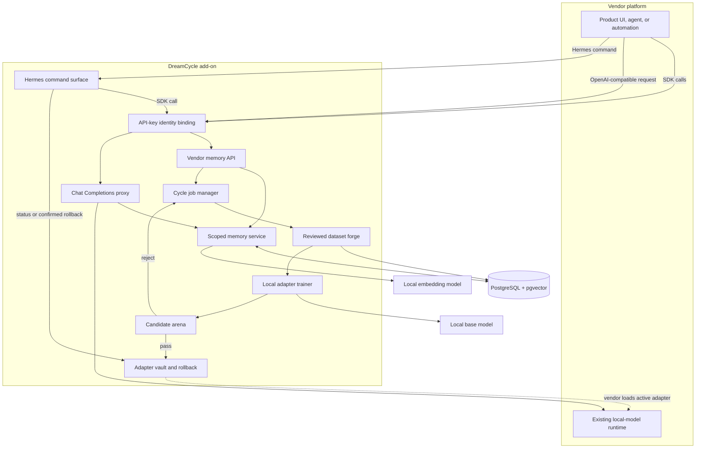
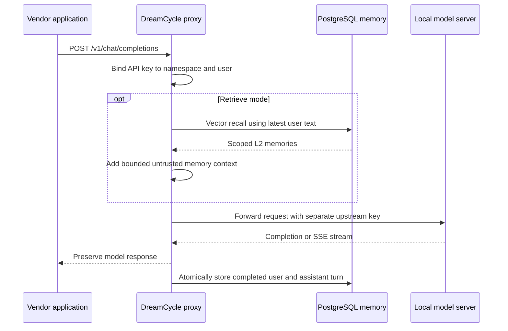
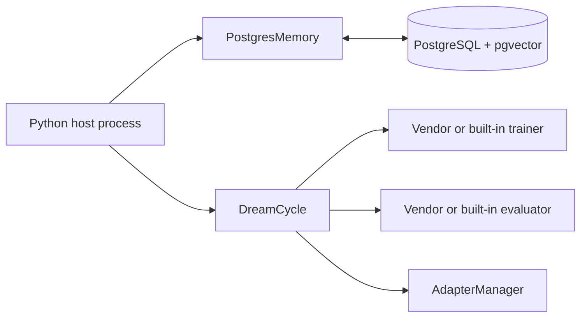
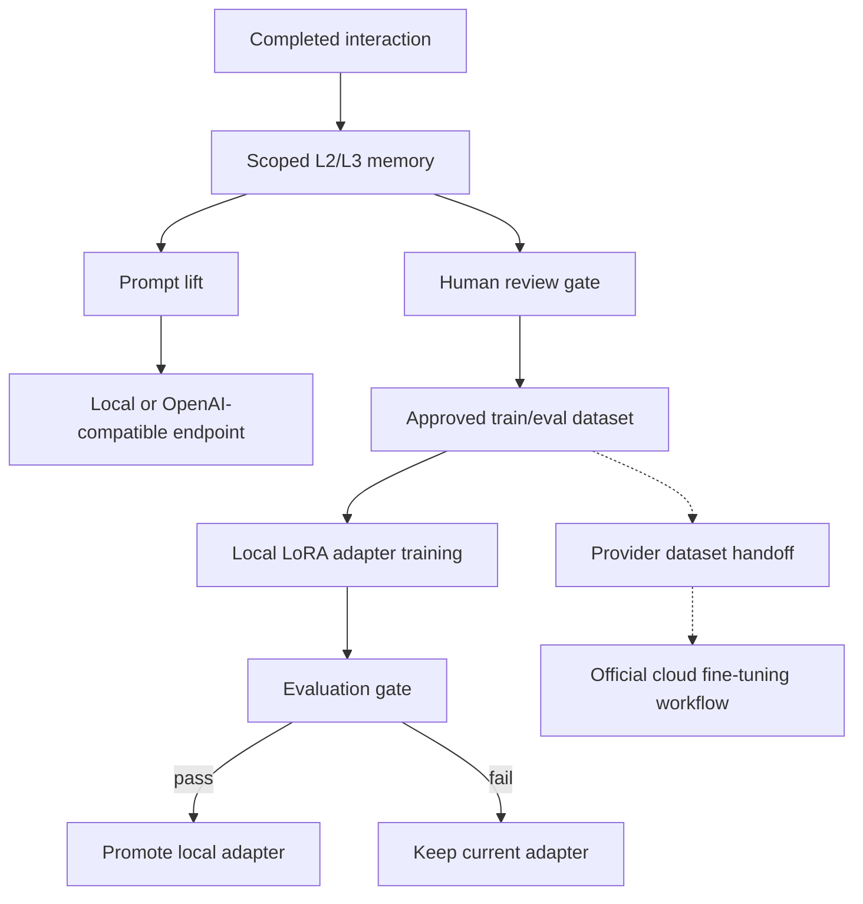
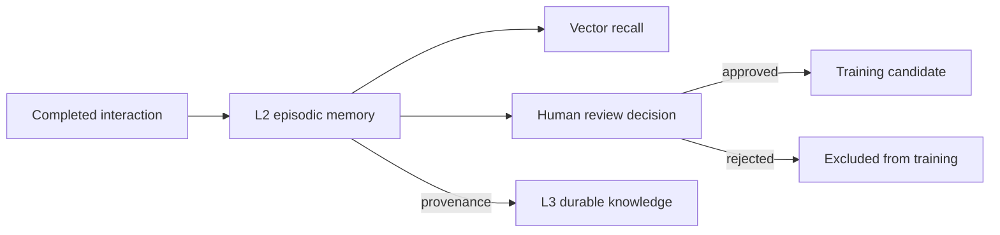
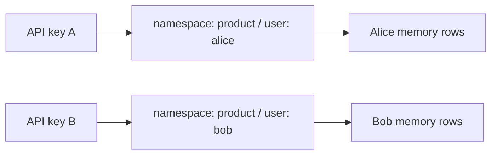
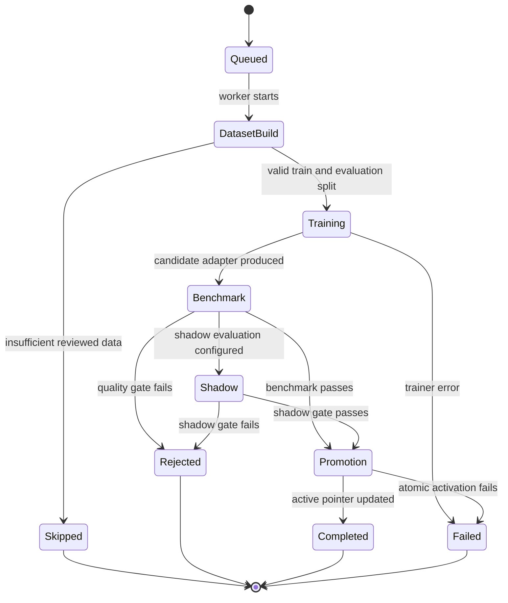
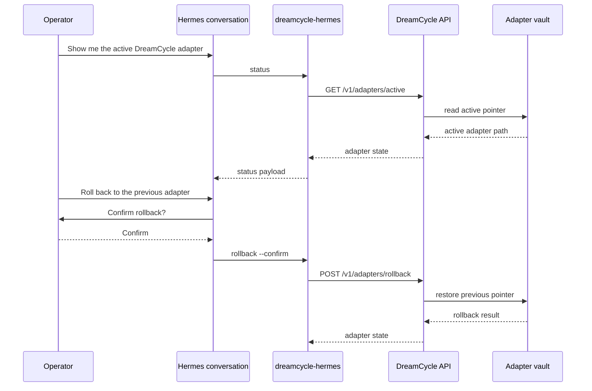
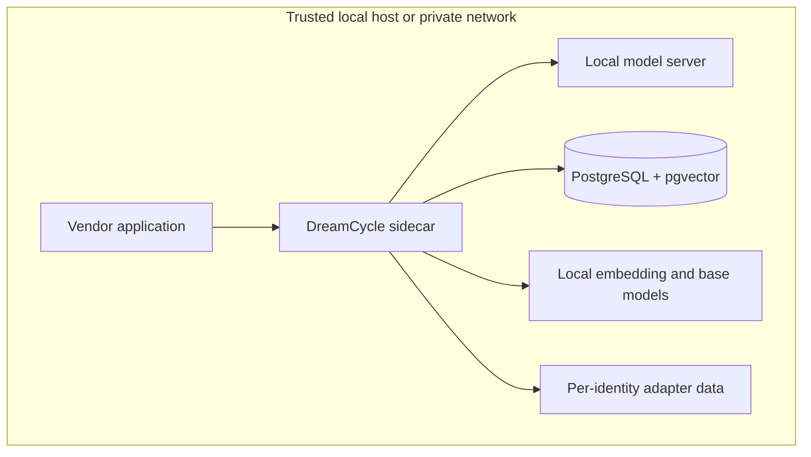

# DreamCycle Architecture

DreamCycle is a **memory-native learning loop for local AI**. It lives beside a
vendor's application and model server, adding durable memory and guarded model
improvement without taking ownership of the entire platform.

Created by **Kenny Jin**.

## The Short Version

An application sends DreamCycle useful interactions. DreamCycle stores them as
scoped L2 memories, recalls relevant experience during later requests, and lets
people explicitly approve the best interactions for training. A dream cycle
builds a dataset, trains a candidate adapter, evaluates it, and changes the
active adapter only when the candidate passes the configured gates.

```text
Memory makes the model useful across sessions.
Review makes the data intentional.
Evaluation makes improvement measurable.
Rollback makes promotion reversible.
```

DreamCycle improves behavior at three layers:

1. **Prompt lift:** retrieved memory changes the context sent to the next model
   request.
2. **Local weight lift:** reviewed examples train and evaluate local adapters.
3. **Cloud dataset lift:** approved examples can be exported for provider-owned
   cloud fine-tuning workflows.

The first layer can help any OpenAI-compatible endpoint immediately. The second
layer is directly implemented for local LoRA adapters. The third layer is an
integration boundary: DreamCycle can produce the reviewed dataset and provenance,
but the cloud provider still owns upload, hosted training, deployment, billing,
and model-version policy.

## System Map



## Three Integration Shapes

### 1. Drop-In Proxy

Use this when the product already supports an OpenAI-compatible Chat
Completions base URL.



The inbound DreamCycle key never goes to the model server. Retrieval or
post-response recording failures do not erase an otherwise successful model
response. A stopped proxy is still an availability failure, because an extra
network hop cannot fail open when the hop itself is gone.

### 2. Vendor SDK

Use this when the Python platform wants explicit control.

```text
DreamCycleClient
  health()
  record()
  record_turn()
  recall()
  review()
  delete()
  start_cycle()
  cycle_status()
  active_adapter()
  rollback_adapter()
```

The SDK talks only to the sidecar contract. It does not need to import the
vendor's inference engine or know how its UI works.

### 3. Embedded Engine

Use this when the host is already Python and does not want another process.



HTTP, embedding, and training dependencies remain optional. Importing the core
package does not load those stacks.

## Model Improvement Layers



DreamCycle directly owns memory, review state, dataset assembly, local adapter
training, evaluation, and local promotion. It does not directly mutate hosted
model weights. For cloud models, DreamCycle's role is to make the prompt better
through recall and to make the fine-tuning input cleaner when a vendor chooses
to use a provider's official training pipeline.

## Memory Model

DreamCycle treats memory as two related layers rather than one giant prompt
history.



### L2: Episodic Memory

L2 stores what happened:

- user and assistant content;
- role and source;
- conversation and trace identity;
- importance and success state;
- review and training approval state;
- classification and metadata;
- local embedding and distance score.

The user and assistant sides of a completed turn are written in one PostgreSQL
transaction. Captured assistant turns begin with `reviewed=false` and
`approved_for_training=false`.

### L3: Durable Knowledge

L3 stores what the system has intentionally distilled:

- vector-searchable knowledge nodes;
- typed relationships between nodes;
- confidence and metadata;
- provenance links back to L2 memories.

L3 promotion rejects source IDs outside the current namespace and user scope.
This keeps a durable claim connected to the evidence that produced it.

## Identity Is a Server Decision



The API key map lives in sidecar configuration. Request bodies do not contain a
trusted namespace or user override. Unknown body fields are rejected, and every
PostgreSQL memory query includes both scope values.

This is intentionally simpler than asking every vendor endpoint to reproduce a
tenant policy system.

## The Guarded Dream Cycle

The cycle is a model-improvement state machine, not a promise that every fine
tune deserves promotion.



### Dataset Forge

Only successful assistant memories that are explicitly reviewed and approved
can become candidates. Whole conversations stay on one side of the train and
held-out evaluation split to reduce leakage.

### Candidate Arena

The built-in evaluator compares candidate and baseline perplexity. Products can
replace it with an evaluator that measures coding accuracy, tool selection,
classification quality, policy adherence, or another domain-specific target.

### Adapter Vault

Promotion copies a candidate into a versioned directory and atomically updates
the active pointer. The previous pointer gives the operator one-step rollback.
Candidate and active paths are constrained to configured roots.

### Hermes Control Surface

Hermes does not need to own DreamCycle internals. The integration surface is a
thin command wrapper over the existing SDK:

```text
dreamcycle-hermes status
dreamcycle-hermes rollback --confirm
```

`status` is read-only and returns the active adapter pointer. `rollback` is
mutation-capable and refuses to run unless the calling tool passes explicit
confirmation. A chat interface should ask the user first, then call the command
with `--confirm` only after that approval.



The command layer exists so Hermes, OpenClaw, shell scripts, or a UI button can
share the same behavior. It is not a second backend.

## Failure Semantics

DreamCycle tries to make failure boring and visible.

| Failure | Behavior |
|---|---|
| Bad or missing sidecar key | `401`; no memory operation |
| Namespace/user override in body | Validation error |
| Missing proxy configuration | `503`; no fake inference success |
| Upstream connection unavailable | Bounded `502` |
| Memory recall fails during proxying | Model request continues without recalled context |
| Memory write fails after model success | Model response remains valid; warning/log is emitted |
| Stream ends before `[DONE]` | Partial assistant output is not stored as complete |
| Cycle already active for identity | `409`; no competing local cycle |
| Training is not configured | `503`; no fake queued job |
| Candidate fails evaluation | Rejected; active adapter is unchanged |
| Promotion fails | Failed report; active pointer is not relabeled as success |
| Agent requests rollback without confirmation | Command refuses before backend mutation |

## Process and Deployment Boundaries



The sidecar binds to loopback by default. DreamCycle does not provide TLS
termination, rate limiting, dynamic key reload, or a hosted control plane in
0.2.0. Operators exposing it beyond a trusted host must add those controls.

Cycle jobs and same-identity locks are process-local. They are truthful for one
sidecar process but are not a distributed scheduler and do not survive restart.

## Package Boundaries

```text
dreamcycle/
  adapters.py            atomic promotion and rollback
  cycle.py               guarded orchestration state machine
  dataset.py             reviewed dataset construction
  evaluation.py          quality and shadow gates
  memory/
    postgres.py          direct L2 and L3 PostgreSQL owner
    embeddings.py        local or application-owned embeddings
    schema.py            pgvector schema and indexes
  sdk/
    client.py            synchronous vendor SDK
    models.py            dependency-light SDK results
  dashboard/             standalone Vite dashboard for local operators
  hermes/
    commands.py          importable status and confirmation-gated rollback facade
    cli.py               dreamcycle-hermes command wrapper
    plugin.py            tiny hook module for Hermes-style chat tools
  server/
    auth.py              API-key identity binding
    app.py               HTTP contract
    jobs.py              asynchronous cycle state
    proxy.py             Chat Completions forwarding and capture
    runtime.py           environment composition
    service.py           transport-independent operations
  training/
    transformers.py      optional Transformers and PEFT implementation
```

One module owns one cohesive responsibility. Core imports remain independent of
FastAPI, HTTPX, Transformers, PEFT, and PyTorch until those features are
explicitly requested.

## Install And Update Packaging

Tagged releases build four install bundles:

```text
dreamcycle-VERSION-linux-x86_64.tar.gz
dreamcycle-VERSION-linux-arm64.tar.gz
dreamcycle-VERSION-macos-x86_64.tar.gz
dreamcycle-VERSION-macos-arm64.tar.gz
```

The public `scripts/install.sh` detects OS and CPU, downloads the matching
GitHub Release bundle, installs the bundled wheel into `~/.dreamcycle/venv`,
copies the built dashboard, and writes command wrappers into `~/.local/bin`.
`dreamcycle-update` reruns the same installer against the latest release.

## What DreamCycle Does Not Own

- The vendor's UI, agent framework, or product workflow.
- The local model server and its availability.
- Consent, retention, deletion, and permission to train.
- Model licensing or rights to collected data.
- Cloud fine-tuning uploads, hosted training jobs, deployment, billing, and
  model-version policy.
- Production TLS, external authentication, and network policy.
- Loading the promoted adapter into every possible inference runtime.
- Proof that a generic metric represents the vendor's real product quality.

Those boundaries are deliberate. DreamCycle should be useful as an add-on,
not become another platform a vendor has to rebuild around.

## Design Principles

1. **Local first:** model data and model paths stay local by default.
2. **Scope every memory operation:** identity comes from trusted configuration.
3. **Review before training:** observation is not consent to fine-tune.
4. **Evaluate before promotion:** training success is not quality evidence.
5. **Preserve rollback:** model changes should be reversible.
6. **Keep failures truthful:** no queued, routed, or partial state becomes fake
   success.
7. **Stay vendor-neutral:** protocols and HTTP contracts beat framework lock-in.
8. **Separate prompt lift from weight lift:** recalled context can improve
   behavior immediately, while training and promotion remain explicit workflows.

## Current Limits

- Chat compatibility is limited to `POST /v1/chat/completions`.
- The SDK is synchronous in 0.2.0.
- Cycle state is in process and non-durable.
- Local model servers may differ in undocumented compatibility behavior.
- Cloud model fine-tuning is export/integration work, not an automatic hosted
  provider call in the core package.
- Real model quality depends on the data, base model, evaluator, and hardware.

These limits are tracked openly because a credible learning system needs clear
boundaries as much as it needs ambitious terminology.
